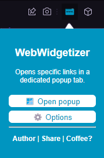

# Web Widgetizer - Enhance Your Browsing Experience

## Table of Contents
- [Overview](#overview)
  - [Key Features](#key-features)
  - [Screenshots](#screenshots)
- [Built with](#built-with)
- [Links](#links)
- [Author](#author)

# Overview

Web Widgetizer is a versatile extension designed to enhance your browsing experience by providing convenient tools for managing and accessing your favorite links. With this extension, users can easily create separate Opera or Firefox windows for specific websites by simply entering the URL. Additionally, users can maintain a personalized database of frequently visited links, allowing for quick access and organization.

## Key Features:

- **Create Popup Windows:**
  Easily open separate Opera or Firefox windows for specific websites. Just enter the URL and create a new window tailored to your needs.

- **Manage Favorite Links:**
  Maintain a personalized database of frequently visited links. Quickly access and organize your favorite websites for seamless browsing.

- **Customizable Popup Windows:**
  Adjust the width and height of popup windows to suit your preferences. Ensure a comfortable browsing experience with customizable settings.

- **Auto-Start Feature:**
  Integrate the extension into your browsing routine with the option to enable or disable the auto-start feature. Enjoy a streamlined experience from the moment you start your browser.

- **Convenient Navigation:**
  Create new popup windows either by clicking a designated button or using a keyboard shortcut (Ctrl + Shift + F1). Enhance productivity and efficiency with easy access to desired content.

Streamline your browsing, manage your favorite links, and enjoy a customized experience with Web Widgetizer - Your Ultimate Browsing Companion.

## Screenshots
Screenshots from Web Widgetizer

## Built with
  - HTML5
  - CSS3
  - JavaScript

## Links
- Website - [www.sehic.rf.gd](https://sehic.rf.gd/)
- Firefox Download - [www.addons.mozilla.org/en-US/firefox/addon/webwidgetizer/](https://addons.mozilla.org/en-US/firefox/addon/webwidgetizer/)
- Opera Download - [www.addons.opera.com/en/extensions/details/web-widgetizer/](https://addons.opera.com/en/extensions/details/web-widgetizer/)
- Contact - [www.sehic.rf.gd/#contact](https://sehic.rf.gd/#contact)

## Author

- LinkedIn - [@Muhammed Šehić](https://www.linkedin.com/in/muhammed-%C5%A1ehi%C4%87-31a7b6175/)
- GitHub - [@MuxBH28](https://github.com/MuxBH28)
- Website - [www.sehic.rf.gd](https://sehic.rf.gd/)
- Contact - [www.sehic.rf.gd/#contact](https://sehic.rf.gd/#contact)
